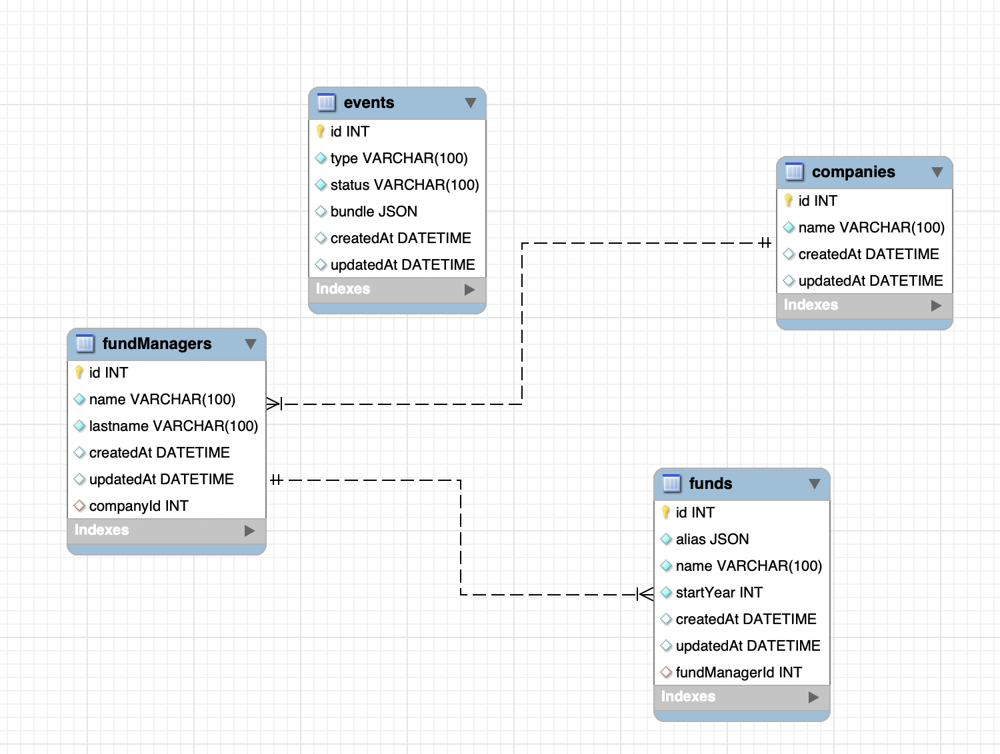

# Funds Manager

Fund Manager allow you to list and update funds, additionally a Event Emitter is triggered if If a new fund is created with a name and manager that matches the name or an alias of an existing fund with the same manager,
throw a duplicate_fund_warning event.


## ER Diagram



### Entity Funds

```
Name: name of the fund
Start year: the year the fund was started
Manager: The company that manages the fund, every fund has 1 manager
Aliases: An alias is an alternative name for a fund, and every fund can have multiple aliases

```

### Entity Fund Managers

```
All funds are created and managed by an investment management company
Name of the company that manages the fund Fund Managers can manage multiple funds
```

### Entity Companies
```
A fund is typically invested in multiple companies.
Name
Multiple funds can be invested in the same company
```

## Requeriments

Node version: v20.6.1
Mysql: 8.1.0

## Environment Variables

The Fund Manager app uses environment variable to setup the Database and some basic rules. Create a `.env` file at the root of the project: 

```
# Port to expose the express application
EXPRESS_PORT=3000

# Mysql Host
DB_HOST=127.0.0.1

# Mysql user
DB_USER=root

# Mysql Password
DB_PASSWORD=awesomePassword

# Mysql Database Name
DB_NAME=awesomeDatabase

# Mysql Database Port
DB_PORT=3306
```

## Getting Started

Let's install all the depencencies in our package.json

```
npm install
```

Then run the app in dev mode so it watch all our ts files

```
npm run dev
```

Therefore let create and popuplate our Database with some data

```
npx ts-node setup/database.ts
npx ts-node setup/seeder.ts
```

and finally use an API Test client like [Insomnia](https://insomnia.rest/) or [Postman](https://www.postman.com/) to test it.

## API

### List all funds by Name, Year and FundManager name

```

GET: /funds

Query Params

year: Start year of the fund (number)
fundManagerName: Fund manager Name assigned to the fund (string)
```

#### Example

```
curl --request GET \
  --url 'http://localhost:3000/funds?year=2020&fundManagerName=ar' \
  --header 'User-Agent: insomnia/2023.5.8'
```

### Update a Fund

```

POST: /funds/:fundId

Body

year: Start year of the fund (number)
alias: Aliases assigned to the fund (string[])
name: Fund's name (string)
```

#### Example

```
curl --request POST \
  --url http://localhost:3000/funds/2406 \
  --header 'Content-Type: application/json' \
  --header 'User-Agent: insomnia/2023.5.8' \
  --data '{"year": 2021, "alias": ["some alias", "another"], "name": "shepard"}'
```
